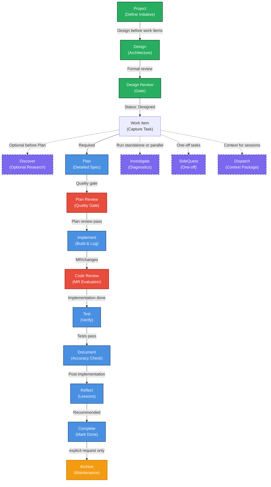

# Workflow Architecture

This document provides a visual representation of all 17 procedures in the workflow framework and their relationships.

## Architecture Diagram



## Legend

- **Green nodes** (Project level): High-level initiative orchestration
- **Blue nodes** (Active workflow): Required sequential chain for work items
- **Red nodes** (Gates): Quality evaluation steps with go/no-go outcomes
- **Orange nodes** (Maintenance): Decoupled operations requiring explicit request
- **Purple dashed nodes** (Optional): Standalone or parallel research/diagnostics

## Architecture Notes

### Active Workflow Chain

The primary workflow for a work item follows this sequence:

```
WorkItem → Plan → PlanReview → Implement → CodeReview → Test → Document → Reflect → Complete
```

Each step is a gate: the output of one step feeds into the next. Status updates (e.g., from PlanReview) determine whether to proceed.

### Optional / Parallel Actions

Three procedures can run independently or in parallel with the main workflow:

- **Discover**: Research and investigation before or during planning. Can run before WorkItem is created, before Plan, or at any point during implementation.
- **Investigate**: Runtime diagnostics and troubleshooting. Can run parallel to any workflow step to gather evidence for decision-making.
- **SideQuest**: One-off tasks that don't require the full Plan→Implement→Test cycle. Minimal overhead procedure for opportunistic work.

### Supporting Actions

- **Dispatch**: Packages context and instructions for specialized agent sessions. Can support any other procedure to ensure the agent has complete information.

### Project-Level Orchestration

Projects follow a separate workflow:

```
Project → Design → DesignReview → WorkItem(s)
```

Multiple work items can originate from a single project. The project provides architectural direction; work items are tactical units.

### Terminal & Maintenance

- **Complete**: Marks a work item's active workflow as finished. This is the logical terminal step within `docs/pending/`.
- **Archive**: Moves a completed work item from `docs/pending/` to `docs/archive/`. This is **not automatic** — it requires explicit user request. Archive is a maintenance/cleanup operation, not part of the active workflow.

## Verification

The audit documented in work item `09-verify-actions-isolated` verified that:

- Each procedure is self-contained with no undocumented cross-dependencies
- Discover and Investigate are properly isolated and can execute standalone
- CodeReview and PlanReview operate at different lifecycle points with no mutual dependencies
- Archive is properly decoupled and does not auto-trigger
- The active workflow chain is clearly documented
